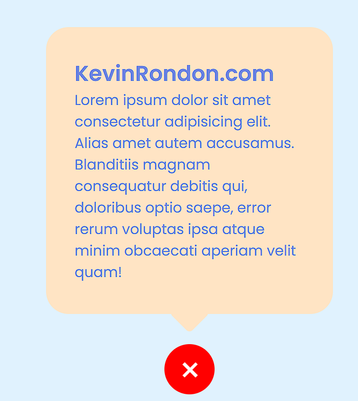

# Toggle
- Project developed as part of educational learning.

-Understand the use of the DOM and use of JavaScript to perform actions directed from JS in order to give a better user experience.

-Use and understanding of the toggle and the advantages it brings to the developer.

- Used technology:
  + HTML 
  + CSS 
  + SCSS 
  + JavaScript 

- 

